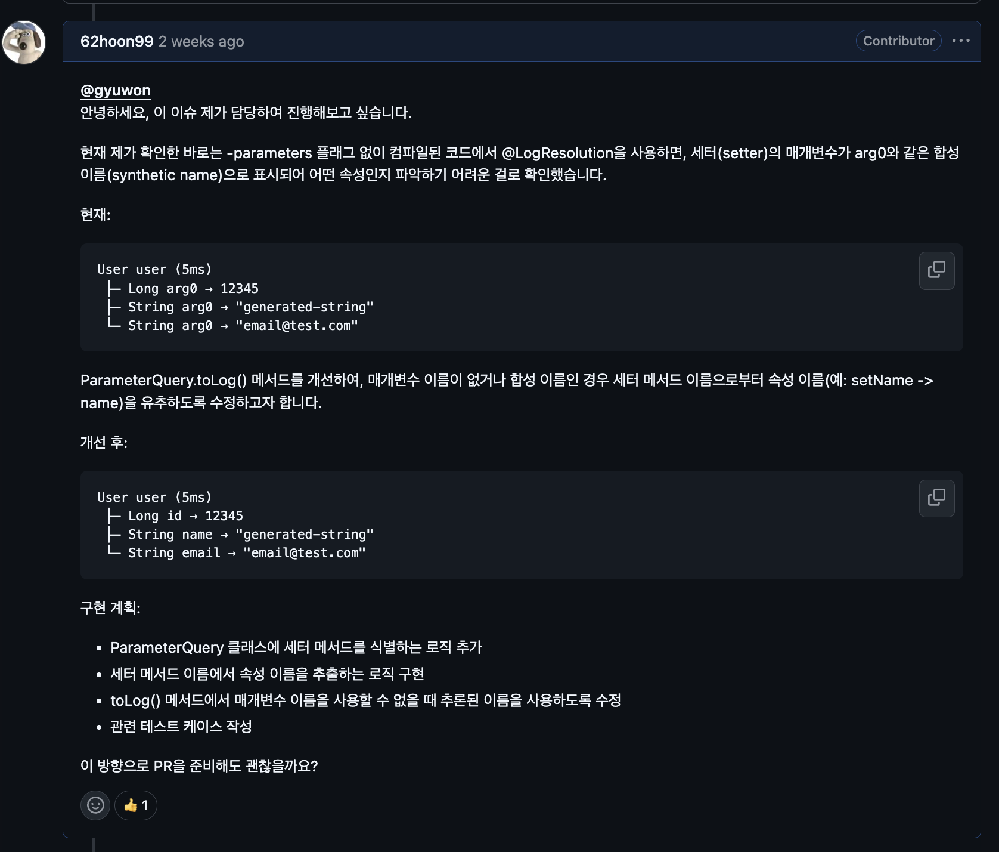

# Auto Params
## Auto Params 오픈 소스에 기여하게 된 계기
[오픈 소스 기여 모임](https://github.com/opensource-contributors-group) 10기에 참가하면서 기여할 오픈소스를 찾게 되었습니다. 그러던 중 이전에 [스프링 캠프 2024](https://springcamp.ksug.org/2024/) 에서 Auto Params의 메인테이너이신 이규원님의 세션을 들었던 기억이 떠올랐습니다.

비록 직접 사용해본 경험은 없었지만, 어떤 프로젝트인지에 대한 기본적인 이해는 있었기 때문에 Auto Params 저장소에 등록된 이슈들을 살펴보게 되었고, 그중 해결 가능하다고 판단한 이슈를 선택하여 기여를 진행하게 되었습니다.

## Auto Params 오픈 소스 소개
AutoParams는 Java 및 Kotlin 기반의 **테스트 데이터 자동 생성 라이브러리**입니다.

테스트 메서드의 매개변수에 자동으로 생성된 값을 주입해 주기 때문에, 개발자는 반복적인 테스트 데이터 준비 작업에서 벗어나 테스트 로직 자체에 집중할 수 있습니다. 이를 통해 테스트 코드의 가독성과 유지보수성이 크게 향상됩니다.

사용 방법은 간단합니다.

@Test 메서드에 @AutoParams 또는 @Process 어노테이션(Kotlin에서는 @AutoKotlinParams)을 추가하면, 테스트 메서드의 매개변수에 자동으로 값이 생성되어 전달됩니다.

``` java
public class AutoParamsExampleTest {  
  
    @Test  
    @AutoParams    
    void testMethod(int a, int b) {  
       Calculator sut = new Calculator();  
       int actual = sut.add(a, b);  
       assertEquals(a + b, actual);  
    }
}
```

## @LogResolution 이란?
AutoParams는 테스트 실행 중 객체가 어떻게 생성되고 해석되는지를 확인할 수 있도록 **상세 로깅 기능**을 제공합니다.

테스트 메서드에 @LogResolution 어노테이션을 추가하면, 각 객체와 필드 값이 어떻게 생성되었는지에 대한 로그가 표준 출력으로 출력됩니다.

이를 통해 테스트 데이터 생성 과정을 쉽게 추적하고 디버깅할 수 있습니다.

**예시 코드**
``` java
public class AutoParamsExampleTest {  
  
    @Test  
    @AutoParams    
    @LogResolution    
    void testMethod(User user) {  
    }  
  
    public record User(UUID id, String email, String username) {  
    }  
}
```

**출력 결과**
```
User user (4ms)
 ├─ UUID id → 85143f69-bb81-4cf2-bedf-3617645bf571 (< 1ms)
 ├─ String email → 4c48a71b-24b2-49f0-8317-f5e31c286e15@test.com (1ms)
 └─ String username → username28fcf5cf-dfea-4a78-9560-58542b1dc35f (< 1ms)
```

# 이슈 선정 및 내용 파악
## 이슈 선정
선택한 [이슈](https://github.com/AutoParams/AutoParams/issues/318)는 메인테이너가 제목만 작성해 둔 상태의 이슈였습니다.
이슈 제목은 **“@LogResolution 사용 시 setter 메서드로부터 속성 이름 추론 기능 추가”** 였습니다.

이슈를 정확히 이해하기 위해 Auto Params의 [공식 문서](https://autoparams.github.io/)를 참고하여 @LogResolution의 동작 방식을 먼저 파악했고, 직접 로컬 환경에서 이슈를 재현해 보았습니다.

### 이슈 설명
-parameters 옵션 없이 컴파일된 코드에서 @LogResolution을 사용하면, setter 메서드의 매개변수 이름이 arg0과 같은 **합성 이름(synthetic name)** 으로 표시됩니다. 이로 인해 로그만 보고 어떤 속성을 의미하는지 파악하기 어려운 문제가 발생합니다.

따라서 매개변수 이름이 없거나 합성 이름인 경우, setter 메서드 이름(예: setName)을 기반으로 실제 속성 이름(name)을 유추하도록 개선이 필요했습니다.

**Before:**
```
User user (5ms)
 ├─ Long arg0 → 12345
 ├─ String arg0 → "generated-string"
 └─ String arg0 → "email@test.com"
```

**After:**
```
User user (5ms)
 ├─ Long id → 12345
 ├─ String name → "generated-string"
 └─ String email → "email@test.com"
```

### Github Issue에 코멘트 작성하기
코드 수정에 앞서, 해당 이슈를 제가 해결하겠다는 의사를 Github 이슈에 먼저 남겼습니다.
이는 다른 기여자와 작업이 겹치는 것을 방지하고, 메인테이너의 방향성과 어긋나지 않도록 하기 위함입니다.

코멘트를 남긴 후 바로 코드 수정을 진행했습니다.



# 코드 수정 및 Pull Request 오픈

## 절차
기여는 다음 절차로 진행했습니다.
1. 오픈소스 저장소를 fork
2. fork한 저장소를 로컬로 clone
3. 이슈 전용 브랜치 생성 (브랜치 네이밍 컨벤션 준수)
4. 코드 수정
    - 코딩 스타일 가이드 확인
    - 프로젝트 기여 가이드 확인
5. 변경사항 push
6. fork한 저장소에서 원본 저장소의 main 브랜치를 대상으로 Pull Request 생성
7. Pull Request 메시지 작성 및 오픈

## 코드 수정 내용
개선한 내용은 다음과 같습니다.
- 로그에 출력할 매개변수 이름이 실제 이름(합성 이름이 아닌 경우)이라면 그대로 사용합니다.
- 매개변수 이름이 없거나 arg0 형태인 경우, 해당 매개변수가 선언된 메서드를 확인합니다.
- 해당 메서드가 setter라면 메서드 이름(예: setName)에서 속성 이름(name)을 추론하여 로그에 출력합니다.

# 메인테이너 리뷰 및 머지
Pull Request를 올린 후 메인테이너로부터 리뷰를 받았습니다.
테스트 코드 구조와 코딩 스타일 관련 피드백이 있었고, 이를 반영하여 코드를 수정했습니다.

특히 코딩 스타일 가이드를 완전히 맞추지 못해 빌드가 실패하는 문제가 있었는데, 해당 부분을 수정한 후 최종적으로 PR이 머지되었습니다.

# 느낀점
이번 기여를 통해 Cursor(AI IDE)를 적극적으로 활용하며 낯선 코드베이스를 빠르게 이해하고 문제를 해결할 수 있었습니다. 또한 오픈소스 기여에서는 기능 구현뿐만 아니라 코딩 스타일 가이드와 기여 규칙을 철저히 지키는 것이 중요하다는 점을 다시 느꼈습니다. 초기에는 이 부분을 충분히 고려하지 못해 빌드 실패와 추가 수정이 발생한 점이 아쉬움으로 남았습니다.

그럼에도 불구하고 내가 수정한 코드가 실제 오픈소스에 반영되고 기여자로 기록된 경험은 큰 동기부여가 되었습니다. 이번 경험을 계기로 앞으로도 꾸준히 오픈소스 기여를 이어가고 싶습니다.
