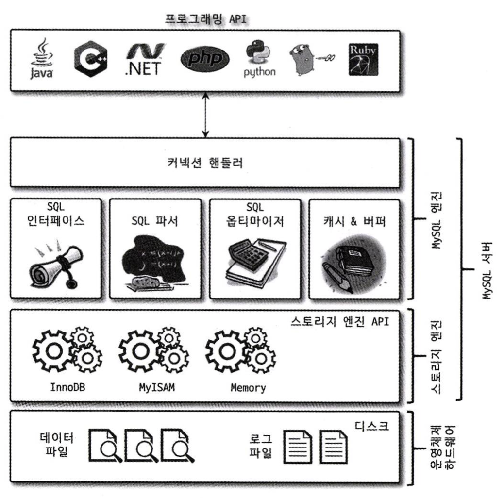
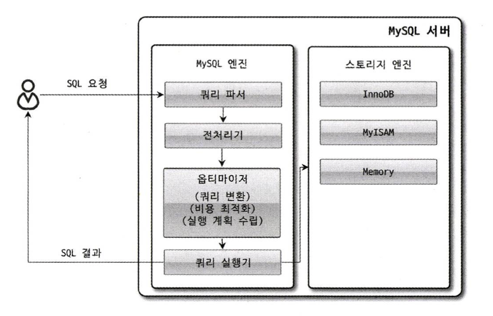

MySQL 서버는 사람의 머리 역할을 담당하는 MySQL 엔진과 손발 역할을 담당하는 스토리지 엔진(ex. InnoDB, MyISAM)으로 구분할 수 있다.

# 4.1.1 MySQL의 전체 구조



**MySQL의 특징**
1. 대부분의 프로그래밍 언어로부터 접근 방법을 모두 지원한다.
2. MySQL 서버는 크게 MySQL 엔진과 스토리지 엔진으로 구분할 수 있다.

## 4.1.1.1 MySQL 엔진
- 클라이언트로부터의 **접속 및 쿼리 요청을 처리하는 커넥션 핸들러**와 **SQL 파서 및 전처리기**, **쿼리의 최적화된 실행을 위한 옵티마이저**가 중심을 이룬다.

## 4.1.1.2 스토리지 엔진
- MySQL 엔진은 요청된 SQL 문장을 분석하거나 최적화하는 등 DBMS의 두뇌에 해당하는 처리를 수행한다.
- 실제 데이터를 디스크 스토리지에 저장하거나 디스크 스토리지로부터 데이터를 읽어오는 부분은 스토리지 엔진이 전담한다.
- MySQL 서버에서 MySQL 엔진은 하나지만 스토리지 엔진은 여러 개를 동시에 사용할 수 있다.

## 4.1.1.3 핸들러 API
- MySQL 엔진의 쿼리 실행기에서 데이터를 쓰거나 읽어야 할 때는 각 스토리지 엔진에 쓰기 또는 읽기를 요청하는데, 이러한 요청을 핸들러 요청이라 하고, 여기서 사용되는 API를 핸들러 API라고 한다.

# 4.1.2 MySQL 스레딩 구조
- MySQL 서버는 프로세스 기반이 아니라 스레드 기반으로 작동하며, 크게 포그라운드 스레드와 백그라운드 스레드로 구분할 수 있다.

## 4.1.2.1 포그라운드 스레드(클라이언트 스레드)

포그라운드 스레드의 특징
- 포그라운드 스레드는 최소한 MySQL 서버에 접속된 클라이언트의 수만큼 존재한다.
- 주로 각 클라이언트 사용자가 요청하는 쿼리 문장을 처리한다.
- 클라이언트 사용자가 작업을 마치고 커넥션을 종료하면 해당 커넥션을 담당하던 스레드는 다시 스레드 캐시로 되돌아간다.
- 이때 이미 스레드 캐시에 일정 개수 이상의 대기 중인 스레드가 있으면 스레드 캐시에 넣지 않고 스레드를 종료시켜 일정 개수의 스레드만 스레드 캐시에 존재하게 한다.

```
## 스레드 캐시(Thread Cache)란?

**스레드 캐시**는 MySQL이 스레드를 매번 새로 생성/삭제하는 비용을 줄이기 위해, 사용이 끝난 스레드를 바로 제거하지 않고 **재사용 목적으로 보관해두는 풀(pool)**이다.

---

### 일반 스레드 vs 캐시드 스레드

|구분|일반 스레드 (새 스레드)|캐시드 스레드 (스레드 캐시)|
|---|---|---|
|생성 시점|새 클라이언트 접속 시 OS 수준에서 새로 생성|이전 커넥션에서 사용 후 캐시에 반납된 스레드|
|비용|생성/초기화 비용 발생|재사용이므로 생성 비용 없음|
|상태|활성 상태로 쿼리 처리 중|대기(idle) 상태로 캐시에서 다음 커넥션을 기다림|

핵심 차이는 **"스레드 생성 비용"**이다. 스레드를 OS 수준에서 새로 만드는 것은 상대적으로 무거운 작업이기 때문에, MySQL은 커넥션이 끊길 때 스레드를 바로 제거하지 않고 캐시에 보관해뒀다가 새 커넥션이 들어오면 꺼내서 재사용한다.
```

스토리지 엔진 별 포그라운드 스레드 사용 방식
- MyISAM: 디스크 쓰기 작업까지 포그라운드 스레드가 처리한다.
- InnoDB: 데이터 버퍼나 캐시까지만 포그라운드 스레드가 처리하고, 나머지 버퍼로부터 디스크까지 기록하는 작업은 백그라운드 스레드가 처리한다.

## 4.1.2.2 백그라운드 스레드

InnoDB의 백그라운드 스레드 사용 방식
- InnoDB에서 데이터를 읽는 작업은 주로 클라이언트 스레드에서 처리되기 때문에 읽기 스레드는 많이 설정할 필요가 없다.
- 쓰기 스레드는 아주 많은 작업을 백그라운드로 처리하기 때문에 스레드 개수를 튜닝해서 사용할 수 있다.

쓰기 지연(버퍼링)
- 사용자의 요청을 처리하는 도중 데이터의 쓰기 작업은 지연(버퍼링)되어 처리될 수 있지만 데이터의 읽기 작업은 절대 지연될 수 없다. 그래서 일반적인 사용 DBMS에는 대부분 쓰기 작업을 버퍼링해서 일괄 처리하는 기능이 탑재되어 있으며, InnoDB 또한 이러한 방식으로 처리한다.
- InnoDB에서는 쓰기 작업을 할 때 완전히 저장 될 때 까지 기다리지 않아도 되지만, MyISAM에서 일반적인 쿼리는 쓰기 버퍼링 기능을 사용할 수 없다.

# 4.1.3 메모리 할당 및 사용 구조

MySQL의 시스템 변수로 설정해 둔 만큼 운영체제로부터 메모리를 할당받는다고 생각해도 된다.
글로벌 메모리 영역과 로컬 메모리 영역은 MySQL 서버 내에 존재하는 많은 스레드가 공유해서 사용하는 공간인지 여부에 따라 구분되며, 각각 다음과 같은 특성이 있다.

## 4.1.3.1 글로벌 메모리 영역
- 일반적으로 클라이언트 스레드의 수와 무관하게 하나의 메모리 공간만 할당된다.
- 생성된 글로벌 영역이 N개라 하더라도 모든 스레드에 의해 공유된다.

## 4.1.3.2 로컬 메모리 영역
- MySQL 서버상에 존재하는 클라이언트 스레드가 쿼리를 처리하는 데 사용하는 메모리 영역이다.
- 클라이언트와 MySQL 서버와의 커넥션을 세션이라고 하기 때문에 세션 메모리 영역이라고도 한다.
- 스레드별로 독립적으로 할당되며 절대 공유되어 사용되지 않는다는 특징이 있다.
- 각 쿼리의 용도별로 필요할 때만 공간이 할당되고 필요하지 않은 경우에는 MySQL이 메모리 공간을 할당조차도 하지 않을 수도 있다.

# 4.1.4 플러그인 스토리지 엔진 모델
- 준먼 검색 엔진을 위한 검색어 파서도 플러그인 형태로 개발해서 사용할 수 있다.

# 4.1.5 컴포넌트
- 8.0 버전 부터는 존의 플러그인 아키텍처를 대체하기 위해 컴포넌트 아키텍처가 지원된다.
- 컴포넌트는 플러그인 방식의 단점(아래 세가지)을 보완한다.
	- 플러그인은 오직 MySQL 서버와 인터페이스할 수 있고, 플러그인끼리는 통신할 수 없음
	- 플러그인은 MySQL 서버의 변수나 함수를 직접 호출하기 때문에 안전하지 않음
	- 플러그인은 상호 의존 관계를 설정할 수 없어서 초기화가 어려움

# 4.1.6 쿼리 실행 구조



## 4.1.6.1 쿼리 파서
- 토큰으로 분리하여 트리 현태의 구조로 만든다.
- 쿼리 문장의 기본 문법 오류는 이 과정에서 발견된다.

## 4.1.6.2 전처리기
- 쿼리 문장의 구조적인 문제점이 있는지 확인한다.
- 객체의 존재 여부와 객체의 접근 권한 등을 확인한다.
- 실제 존재하지 않거나 권한상 사용할 수 없는 개체의 토큰은 이 단계에서 걸러진다.

## 4.1.6.3 옵티마이저
- 사용자의 요청으로 들어온 쿼리 문장을 저렴한 비용으로 가장 빠르게 처리할지를 결정하는 역할을 담당한다.

## 4.1.6.4 실행 엔진
- 옵티마이저가 세운 **실행 계획대로 각 단계를 순서에 맞게 조율**하는 역할을 한다.
- 직접 데이터를 읽고 쓰지 않고, **핸들러에게 작업을 요청**하고 결과를 받아 다음 단계로 넘긴다.
- 매니저(지시자) 역할이라고 볼 수 있다.

## 4.1.6.5 핸들러(스토리지 엔진)
- **실제로 데이터를 디스크에 저장하고 읽어오는** 역할을 담당한다.
- MySQL에서 핸들러는 곧 **스토리지 엔진**(InnoDB, MyISAM 등)을 의미한다.
- 실행 엔진의 요청을 받아 처리하는 **실행자(Worker)** 역할이다.

# 4.1.7 복제
16장에서 다룬다.

# 4.1.8 쿼리 캐시
- SQL의 실행 결과를 메모리에 캐시하고, 동일 SQL 쿼리가 실행되면 테이블을 읽지 않고 즉시 결과를 반환한다.
- 하지만 쿼리 캐시는 테이블의 데이터가 변겨오디면 캐시에 저장된 결과 중에서 변광된 테이블과 관련된 것들을 모두 삭제해야 했다. 이는 심각한 동시 처리 성능 저하를 유발한다.
- 8.0 버전에서는 MySQL 서버의 기능에서 쿼리 캐시는 완전히 제거되고, 관련된 시스템 변수도 제거되었다. (부록1)

# 4.1.9 스레드 풀
- MySQL 엔터프라이즈 버전은 스레드 풀을 지원하지만 커뮤니티 버전은 지원하지 않는다.
- Percona Server에서 제공하는 스레드 풀 기능을 살펴보면 사실상 스레드 풀을 사용한다고 해서 성능적인 이점이 없음. (부록2)

# 4.1.10 트랜잭션 메타 데이터
- 8.0 버전부터 데이터 딕셔너리와 시스템 테이블이 모두 트랜잭션 기반의 InnoDB 스토리지 엔진에 저장되도록 개선되면서 이제 스키마 변경 작업 중간에 MySQL 서버가 비정상적으로 종료된다고 하더라도 스키마 변경이 완전한 성공 또는 완전한 실패로 정리된다.
- 기존의 파일 기반 메타데이터를 사용할 때와 같이 작업 진행 중인 사태로 남으면서 문제를 유발하지 않게 개선된 것이다.

---
# 부록
## (1) 왜 MySQL 쿼리 캐시는 성능이 나빴나?

### 핵심 원인: 캐시 무효화 단위가 "테이블" 전체

MySQL 쿼리 캐시는 테이블 데이터가 **단 한 건이라도 변경(INSERT/UPDATE/DELETE)되면, 해당 테이블과 관련된 캐시를 전부 삭제**해야 했다.

```
UPDATE users SET name = '홍길동' WHERE id = 1;
                    ↓
users 테이블 관련 캐시 전부 삭제
- SELECT * FROM users WHERE id = 2  ← 삭제
- SELECT count(*) FROM users        ← 삭제
- SELECT * FROM users WHERE ...     ← 삭제 (수백~수천 건)
```

그리고 이 삭제 작업을 하는 동안 **캐시 전체에 Lock**이 걸린다. 즉, 쓰기가 많은 서비스일수록 Lock 경합이 폭발적으로 증가한다.

---

### "그럼 Redis/로컬 캐시는 왜 괜찮은가?"

차이는 **캐시 무효화의 책임과 단위**에 있다.

|구분|MySQL 쿼리 캐시|Redis / 로컬 캐시|
|---|---|---|
|무효화 주체|MySQL이 **자동**으로 처리|**애플리케이션**이 직접 처리|
|무효화 단위|관련 테이블 전체|개발자가 **필요한 키만** 선택적으로 삭제|
|Lock 범위|캐시 전체에 Lock|해당 키만 영향|
|변경 감지|모든 쓰기에 반응|개발자가 **의도한 시점**에만 반응|

---

### 구체적인 예시

```java
// 애플리케이션 캐시 (Redis)
// 개발자가 변경이 필요한 시점을 직접 제어
public void updateUser(User user) {
    userRepository.save(user);
    redisCache.delete("user:" + user.getId()); // 이 키만 삭제
    // 다른 캐시들은 건드리지 않음
}
```

- Redis는 `user:1` 키만 삭제하면 끝
- 다른 캐시(`user:2`, `product:list` 등)는 전혀 영향 없음
- Lock도 해당 키 수준에서만 발생

---

### 한 줄 핵심 정리

> MySQL 쿼리 캐시가 느린 이유는 캐싱 자체가 문제가 아니라, **"쓰기 발생 → 테이블 전체 캐시 삭제 → 전체 Lock"** 이라는 구조적 문제 때문이다. Redis/로컬 캐시는 **개발자가 무효화 범위를 직접 제어**하기 때문에 이 문제를 피할 수 있다.


---
## (2) 왜 MySQL에서 스레드 풀은 이점이 없나?

### 먼저, MySQL의 작업 특성 이해

MySQL 쿼리 처리는 대부분 **CPU + Disk I/O 집약적** 작업이다.

```
클라이언트 요청 → 파싱 → 옵티마이저 → 디스크 I/O → 결과 반환
```

이 과정에서 하나의 쿼리가 **처음부터 끝까지 하나의 스레드를 점유**한다. 즉, 스레드가 I/O 대기 중에도 다른 작업을 처리하지 못하고 그냥 대기한다.

---

### 스레드 풀의 역설: 오히려 대기가 생긴다

```
커넥션 100개 / 스레드 풀 크기 4개

커넥션 1~4:   즉시 처리 ✅
커넥션 5~100: 큐에서 대기 ⏳ (스레드가 날 때까지)
```

- 스레드 4개가 전부 Disk I/O로 막혀있으면 나머지 96개는 그냥 기다려야 함
- MySQL은 쿼리 하나가 길게 점유하는 구조라 **스레드 수를 줄이는 게 오히려 병목**이 됨
- 결국 "동시 처리량 제어"라는 스레드 풀의 장점이 MySQL에선 **응답 지연**으로 돌아옴

---

### 그럼 왜 Tomcat/HikariCP는 스레드 풀이 효과적인가?

작업의 성격이 근본적으로 다르기 때문이다.

|구분|MySQL 스레드|Tomcat 스레드 / HikariCP|
|---|---|---|
|작업 성격|쿼리 하나가 스레드를 **길게 점유**|HTTP 요청 처리 중 **I/O 대기가 잦음**|
|I/O 대기 중|다른 작업 못함 (스레드 낭비)|대기 중 다른 요청 처리 가능|
|스레드 수 제한 효과|병목 발생|리소스 보호 효과 ✅|
|주된 목적|빠른 쿼리 처리|과부하 방지, 리소스 제어|

```
// Tomcat 스레드 풀의 경우
스레드 1: 요청 처리 중 → DB 쿼리 대기 중 (I/O)
                              ↓
                    이 틈에 다른 요청 처리 가능 ✅

// MySQL 스레드의 경우
스레드 1: 쿼리 처리 중 → Disk I/O 대기 중
                              ↓
                    그냥 대기만 함 ❌ (다른 쿼리 못 받음)
```

---

### 한 줄 핵심 정리

> Tomcat/HikariCP는 **"I/O 대기 중 다른 작업 처리"** 가 가능한 구조라 스레드 풀이 효율적이지만, MySQL은 **"쿼리 하나가 스레드를 끝까지 점유"** 하는 구조라 스레드 풀이 오히려 병목이 된다. MySQL에서는 스레드 캐시로 생성 비용만 줄이는 것이 더 적합하다.