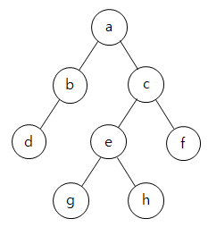

# 소프트웨어 공학
# UML 다이어그램
- 순차 다이어그램은 행위 다이어그램이므로 동적이고, 순차적인 표현을 위한 다이어그램임
- 구조적(Structural) 다이어그램 = 정적 모델링: 시스템의 물리적 구조나 정적인 관계를 나타낸다.
- 행위(Behavioral) 다이어그램 = 동적 모델링: 시스템의 동작이나 상태 변화를 나타낸다.
- **시간 흐름**이라는 단어가 나오면? → **순차(Sequence) 다이어그램**
- **사용자 요구사항** 정의 시 사용되는 것은? → **유스케이스(Use Case) 다이어그램**
- 구조적 다이어그램이 **아닌** 것은? → 보기 중에 '순차', '상태', '활동' 등을 찾기
- **객체 간의 링크**를 강조하고 메시지를 표현하는 것은? → **커뮤니케이션 다이어그램**

# 애자일 방법론
애자일 파트는 "유연함, 소통, 반복"이라는 키워드만 잘 붙들고 있기

- 익스트림 프로그래밍은 애자일 방법론 중 하나임 (구조적 방법론 X)

애자일 선언문
- **개인과 상호작용** > 프로세스나 도구
- **실행되는 소프트웨어** > 방대한 문서
- **고객과의 협력** > 계약 협상
- **변화에 대응** > 계획 준수

**오답 포인트**
1. "폭포수 모델(Waterfall)은 애자일의 일종이다." (**X** → 폭포수 모델은 고전적/선형적 모델)
2. "애자일은 계획 수립과 문서화에 가장 큰 비중을 둔다." (**X** → 문서보다는 **동작하는 소프트웨어**에 우선순위를 둔다.)
3. "XP의 5대 가치에는 '정형 분석'이나 '계획 준수'가 포함된다." (**X** → 정형 분석은 전통적 방법론의 특징)

# 유스케이스

**유스케이스 다이어그램의 정의**
개발될 시스템이 제공해야 하는 기능을 **사용자(Actor)의 관점**에서 표현한 것이다. 시스템의 **외부 요구사항**을 모델링하는 데 사용된다.

**유스케이스 다이어그램의 4대 구성 요소**
- **시스템(System):** 개발하고자 하는 소프트웨어 범위. (커다란 사각형으로 표현)    
- **액터(Actor):** 시스템과 상호작용하는 외부 엔티티.
    - **주액터:** 시스템을 사용하는 사람 (보통 졸라맨 모양).
    - **부액터:** 시스템과 연동되는 외부 시스템이나 데이터베이스.
- **유스케이스(Use Case):** 시스템이 제공하는 개별적인 서비스나 기능. (타원형으로 표현)
- **관계(Relationship):** 액터와 유스케이스, 유스케이스와 유스케이스 사이의 연결.

**기출 내용**
- 유스케이스에서는 '구체화'가 사용되지 않는다. 구체화는 일반적으로 소프트웨어에서 요구 사항이나 개념을 구체적인 설계나 구현으로 전환하는 과정을 설명할 때 사용된다.

# 요구사항 분석

기능적 요구사항 vs 비기능적 요구사항
- 기능적 요구사항: 시스템이 실제로 어떻게 동작하는지에 관점을 둔 요구사항
- 비기능적 요구사항: 시스템 구축에 대한 성능, 보안, 품질, 안정 등에 대한 실제 수행에 보조적인 요구사항

---
# 소프트웨어 개발
# 객체지향

**객체지향 4대 원칙**
1. 캡슐화 (Encapsulation) 
	- **정의:** 데이터(변수)와 기능(메서드)을 하나로 묶고, 외부에서 접근을 제한하는 것(정보 은닉)
	- **특징:** `private`, `getter`/`setter`를 사용하여 데이터 보호 및 외부 의존도를 줄여 유지보수가 용이해진다.

2. 상속 (Inheritance)
	- **정의:** 부모 클래스의 특성(필드, 메서드)을 자식 클래스가 물려받아 재사용하는 것.
	- **특징:** 기존 클래스를 확장하여 코드의 재사용성을 높이고, 일관성을 유지할 수 있다. 

3. 다형성 (Polymorphism)
	- **정의:** 하나의 객체나 메서드가 여러 가지 형태를 가질 수 있는 능력.
	- **특징:** 오버라이딩(Overriding)이나 오버로딩(Overloading)을 통해 같은 이름의 메서드가 다른 동작을 수행하여 코드 유연성을 증대시킨다. 

4. 추상화 (Abstraction)
	- **정의:** 불필요한 세부 구현은 숨기고, 객체의 필수적인 공통 특징(구조, 기능)만 정의하는 것.
	- **특징:** 추상 클래스나 인터페이스를 사용하여 복잡성을 낮추고 설계를 단순화한다.

**SOLID 원칙**
- S: 단일 책임 원칙 (Single Responsibility Principle, SRP)
    - **내용:** 클래스는 하나의 이유로만 변경되어야 합니다. 즉, 하나의 클래스는 하나의 책임만 가져야 한다.
    - **목표:** 변경의 원인을 하나로 집중시켜 영향 범위를 최소화한다.

- O: 개방-폐쇄 원칙 (Open-Closed Principle, OCP)
    - **내용:** 소프트웨어 요소(클래스, 모듈, 함수)는 확장에는 열려 있고, 변경에는 닫혀 있어야 한다.
    - **목표:** 기존 코드를 수정하지 않고 새로운 기능을 추가할 수 있도록 한다 (다형성 활용).

- L: 리스코프 치환 원칙 (Liskov Substitution Principle, LSP)
    - **내용:** 자식 클래스는 언제나 부모 클래스를 대체할 수 있어야 하며, 대체되더라도 프로그램의 의도된 동작을 유지해야 한다.
    - **목표:** 상속 관계의 안정성과 일관성을 보장하여 예측 가능한 코드를 만든다.

- I: 인터페이스 분리 원칙 (Interface Segregation Principle, ISP)
    - **내용:** 클라이언트는 자신이 사용하지 않는 메서드에 의존하도록 강요받지 않아야 한다. 인터페이스는 클라이언트에 맞게 작게 분리되어야 한다.
    - **목표:** 불필요한 의존성을 제거하고, 특정 인터페이스의 변경이 다른 클라이언트에 영향을 주지 않도록 한다.

- D: 의존 역전 원칙 (Dependency Inversion Principle, DIP)
    - **내용:** 상위 모듈은 하위 모듈에 의존해서는 안 되며, 둘 다 추상화에 의존해야 합니다. 또한 추상화는 구체화에 의존해서는 안 되고, 추상화가 구체화에 의존해야 합니다.
    - **목표:** 느슨한 결합을 통해 모듈의 독립성을 높이고 유연성을 확보합니다.

# MVC 패턴

**MVC 패턴의 기본 개념 (이론)**
MVC는 소프트웨어를 세 가지 역할로 나누어 **결합도를 낮추고 유지보수성을 높이는** 디자인 패턴이다.
- **Model (모델):** 시스템의 **비즈니스 로직과 데이터**를 담당한다. (데이터베이스와 상호작용, 데이터 처리)
- **View (뷰):** 사용자에게 보여지는 **화면(UI)**을 담당한다. 모델의 데이터를 받아서 시각적으로 표현한다.
- **Controller (컨트롤러):** 사용자의 **입력을 받아 모델과 뷰를 연결**하는 제어 로직을 담당한다.

**MVC 패턴을 사용하는 이유**
- **독립성:** 화면(View)을 바꿔도 로직(Model)은 건드릴 필요가 없다.
- **재사용성:** 하나의 모델에 대해 여러 개의 뷰(웹용, 모바일 앱용 등)를 만들 수 있다.
- **분업:** 디자이너(View)와 개발자(Model/Controller)의 작업 영역이 분리된다.

# 통합 테스트

**하향식 설계**  
- 소프트웨어설계 시 제일 상위에 있는 main user function에서 시작하여 기능을 하위 기능들로 분할해 가면서 설계하는 방식  
- 넓이 우선(Breadth First) 방식으로 테스트를 할 모듈을 선택할 수 있다.  
- 모듈 간의 인터페이스와 시스템의 동작이 정상적으로 잘 되고 있는지를 빨리 파악하고자할 때 상향식보다는 하향식 통합 테스트를 사용하는 것이 좋다.  

**상향식 설계**  
- 가장 기본적인 컴포넌트를 먼저 설계한 다음 이것을 사용하는 상위 수준의 컴포넌트를 설계하는 방식

# 워크스루

워크스루(Walkthrough)
- 단순한 테스트 케이스를 이용하여 프로덕트를 수작업으로 수행해 보는 것이다.
- 사용사례를 확장하여 명세하거나 설계 다이어그램, 원시코드, 테스트 케이스 등에 적용할 수 있다.  
- 복잡한 알고리즘 또는 반복, 실시간 동작, 병행 처리와 같은 기능이나 동작을 이해하려고 할 때 유용하다. 
  
오답피하기 | 인스펙션(Inspection)  
- 소프트웨어 요구, 설계, 원시 코드 등의 작성자 외의 다른 전문가 또는 팀이 검사하여 오류를 찾아내는 공식적 검토 방법

# 화이트/블랙 박스 테스트
## 화이트 박스 테스트

- 모듈의 원시 코드를 오픈시킨 상태에서 코드의 논리적 모든 경로를 테스트하는 방법이다.  
- Source Code의 모든 문장을 한 번 이상 수행함으로써 진행된다.  
- 종류 : 기초 경로검사. 제어구조검사  
- 화이트박스 테스트의 이해를 위해 논리 흐름도(Logic-Flow Diagram)를 이용할 수 있다.  
- 테스트 데이터를 이용해 실제 프로그램을 실행함으로써 오류를찾는 동적 테스트(Dynamic Test)에 해당한다.  
  
오답피하기  
- 프로그램의 구조를 고려한다.

## 블랙 박스 테스트

- 블랙박스 테스트는 **기능 테스트(Functional Testing)**라고도 불린다.
- **관점:** 사용자 관점에서 소프트웨어의 기능을 확인한다.
- **검증 대상:** 프로그램의 **내부 구조(소스 코드)**는 무시하고, 명세서대로 동작하는지(Input -> Output)를 확인한다.
- 설계 사양서나 요구사항 정의서를 기반으로 테스트 케이스를 설계한다.
- 시스템 외부와의 인터페이스, 데이터 구조, 성능 등에서 발생하는 오류를 찾는 데 효과적이다.
- 개발자가 아닌 별도의 테스터가 객관적으로 수행할 수 있다.

# 선형 검색(Linear Scanning)  

- 원하는 레코드를 찾을 때까지 처음부터 끝까지 차례로 하나씩 비교하면서 검색 한다.  
- 단점 : 단순한 방식으로 정렬되지 않는 검색에 가장 유용하며 평균 검색시간이 많이 걸린다.  
- 평균 검색 회수 :(n+1)/2  
- 데이터가 모인 집합(배열, 링크드리스트 등)의 처음부터 끝까지 하나씩 순서대로 비교하며 원하는 값을 찾아내는 알고리즘이다.  
- 순차검색이라고도 한다.  
  
오답피하기  
- 데이터 집합이 정렬되어 있을 필요는 없다. 정렬이 선행되어야 하는 검색 기법은 이진검색 기법이다.

# 정렬 알고리즘
- 버블 정렬: 오름차순 수행시 매 회전(Pass)마다 마지막 값이 가장 큰 값이 된다.
- 삽입 정렬: index 1 부터 시작하며, 자신보다 더 작은 값이 나올 때 까지만 아래 index로 이동한다.
- 선택 정렬: 전체를 순회하여 제일 작은 값을 찾아서 index 0에 위치시키고, 다음은 index 1에 위치시키고,,

# 후위순회, 전위순회

후위순회: d -> b -> g -> h -> e -> f -> c -> a
전위순회: a -> b -> d -> c -> e -> g -> h -> f

# 코드 인스펙션

**코드 인스펙션(Code Inspection)**은 소프트웨어 개발 단계에서 코드를 실행하지 않고, 사람이 직접 눈으로 확인하며 결함을 찾아내는 **가장 공식적이고 엄격한 검토 방법**이다.

정보처리기사 시험에서는 **정적 테스트(Static Testing)**의 한 종류로 분류되며, 동료 검토(Peer Review)나 워크스루(Walk-through)보다 훨씬 절차가 까다롭다는 점이 핵심이다.

**💡 정보처리기사 꿀팁:** 문제에서 **"공식적인 검토 회의"**, **"체크리스트 활용"**, **"중재자(Moderator) 존재"** 같은 키워드가 나오면 정답은 무조건 **코드 인스펙션**.

---
# 데이터베이스

---
# 프로그래밍 언어 활용

# UNIX

UNIX의 특징  
- Multi-User 및 Multi-Tasking을 지원한다.  
- 네트워킹 시스템이며 대화식 운영체제이다.  
- 높은 이식성과 확장성, 프로세스 간 호환성이 높다.  
- 트리 구조의 계층적 파일 시스템을 갖는다.

# IP
체크섬이란?  
- 네트워크를 통해서 전송된 데이터의 값이 변경되었는지(무결성)를 검사하는 값이다.  
- 무결성을 통해서 네트워크를 통해서 수신된 데이터에 오류가 없는지 여부를 확인한다.  
IP 헤더 체크섬  
- IP헤더 체크섬은 일반적으로 IP헤더를 따르는 데이터는 자체 체크섬을 가지고 있기때문에 IP 헤더를 통해서만 계산된다.

# 결합도

결합도 종류  
- 데이터 결합도(Data Coupling) : 한 모듈이 파라미터나 인수로 다른 모듈에게 데이터를 넘겨주고 호출 받은 모듈은 받은 데이터에 대한 처리 결과를 다시 돌려주는 경우의 결합도  
- 스탬프 결합도(Stamp Coupling) : 두 모듈이 동일한 자료구조를 조회하는 경우의 결합도  
- 제어 결합도(Control Coupling) : 한 모듈이 다른 모듈의 내부 논리 조직을 제어하기 위한 목적으로 제어신호를 이용하여 통신하는 경우의 결합도  
- 외부 결합도(External Coupling) : 한 모듈에서 외부로 선언한 변수를 다른 모듈에서 참조할 경우의 결합도  
- 공통 결합도(Common Coupling) : 한 모듈이 다른 모듈에게 제어 요소를 전달하고 여러 모듈이 공통 자료영역을 사용하는 경우의 결합도  
- 내용 결합도(Content Coupling) : 한 모듈이 다른 모듈의 내부 기능 및 그 내부 자료를 참조하는 경우의 결합도

---
# 정보시스템구축관리

# 시스템 공격 기법
Session Hijacking(TCP 세션 하이재킹)​  
- 케빈 미트닉이 사용했던 공격 방법 중 하나로, TCP의 세션 관리 취약점을 이용한 공격기법이다.  
Piggyback Attack​  
- 사회공학적 방법으로 몰래 따라 들어가는 방법이다. 대체로 (중요한 정보를 취급하는 곳 또는 회사 입구 등) 물리적인 보안 장치들이 많이 존재하는 장치들을 우회하는 방법이다.  
XSS(=CSS, Cross Site Scripting)​  
- 공격자가 게시판에 악성 스크립트를 작성, 삽입하여 사용자가 그것을 보았을 때 이벤트 발생을 통해 사용자의 쿠키 정보, 개인 정보 등을 특정 사이트로 전송하는 공격기법이다.  
CSRF(Cross Site Request Forgery)  
- 사용자가 자신의 의지와는 무관하게 공격자가 의도한 행위(수정, 삭제, 등록 등)을 특정 웹 사이트에 요청하게 하는 공격기법이다.

# 사용자 인증 유형

- Type 1(지식): 체는 '그가 알고 있는 것'을 보여주며 예시로는 패스워드, PIN 등이 있다.  
- Type 2(소유): 주체는 '그가 가지고 있는 것'을 보여주며 예시로는 토큰, 스마트카드 등이 있다.  
- T**ype 3(존재): 주체를 나타내는 것을 보여준다. 예: 생체인증**  
- Type 4(행위): 주체는 '그가 하는 것'을 보여주며 예시로는 서명, 움직임, 음성 등이 있다.  
- Two Factor: 위 타입 중 두가지 인증 매커니즘을 결합하여 구현. 예: 토큰+PIN-6.  
- Multi Factor: 가장 강한 인증, 3가지 이상의 매커니즘 결합.  
- Type 3과 Type 4를 합쳐 생체 인증이라고도 한다.

# PERT 차트

PERT(Program Evaluation and Review Technique)  
- 소요 시간 예측이 어려운 경우 최단 시간 내에 완성할 수 있게 하는 프로젝트 일정 방법  
- 계획공정(network)을 작성하여 분석하므로 간트도표에 비해 작업계획을 수립하기 쉽다.  
- 계획공정의 문제점을 명확히 종합적으로 파악할 수 있다.  
- 관계자 전원이 참가하게 되므로 의사소통이나 정보교환이 용이하다.

# 인증
> Authentication -> 인증, Authorization -> 권한부여

AAA(Authentication Authorization Accounting)  
- 인증 권한검증 계정관리  
- 시스템의 사용자가 로그인하여 명령을 내리는 과정에 대한 시스템의 동작을 Authentication(인증), Authorization(권한부여)