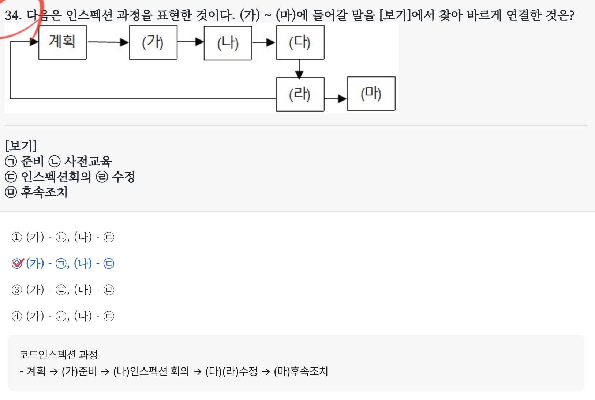

# 소프트웨어 설계

## 소프트웨어의 상위 설계 하위 설계

**상위 설계**
- 아키텍쳐 설계
- 데이터 설계
- 인터페이스 설계
- 사용자 인터페이스 설계

**하위 설계**
- 모듈 설계
- 자료구조 설계
- 알고리즘 설계

## 코드 오류

필사 오류(Transcription Error)  
- 입력 시 한 자리를 잘못 기록하는 오류(예 : 1234 → 1235)  
  
전위 오류(Transposition Error)  
- 입력 시 좌우 자리를 바꾸어 발생하는 오류(예 : 1234 → 1243)  
  
이중 오류 (Double Transposition Error)  
- 전위 오류가 두 개 이상 발생하는 오류(예 : 1234 → 2143)  
  
생략 오류(Missing Error)  
- 입력 시 한 자리를 빼고 기록하는 오류(예 : 1234 → 123)  
  
추가 오류(Addition Error)  
- 입력 시 한 자리를 추가해서 기록하는 오류(예 : 1234 → 12345)  
  
임의 오류(Random Error)  
- 두 가지 이상의 오류가 결합해서 발생하는 오류(예 : 1234 → 21345)

---
# 데이터베이스 로그(log)를 필요로 하는 회복 기법

즉각 갱신법  
- 데이터를 갱신하면 트랜잭션이 완료되기 전에 실제 데이터베이스에 반영하는 방법이다.  
- 회복 작업을 위해서 갱신내용을 별도 Log로 기록해야 한다.  
- Redo, Undo 모두 사용가능하다.

# INTERSECT vs UNION vs EXCEPT

|**연산자**|**의미**|**중복 제거**|
|---|---|---|
|UNION|합집합|제거|
|UNION ALL|합집합|유지|
|INTERSECT|교집합|제거|
|EXCEPT (MINUS)|차집합|제거|
# 개체-관계 모델의 E-R 다이어그램에서 사용되는 기호와 그 의미의

- 삼각형 - 없음(확장된 다이어그램에서는 존재)
- 사각형 - 개체(Entity)  
- 마름모 - 관계(Relationship)  
- 타원 - 속성(Attribute)

# 릴레이션의 특징

1. **튜플은 중복될 수 없다.**
2. **속성의 순서는 중요하지 않다.**
3. **튜플의 순서는 중요하지 않다.**
4. **모든 속성 값은 원자값(Atomic Value)이다.** (더 이상 쪼갤 수 없음)
5. **각 속성은 하나의 도메인을 가진다.**
6. **릴레이션은 키(Key)를 가진다.**

# Exists

Exists는 행 기준이다. 한 행 씩 EXISTS 에 정의한 쿼리가 실행된다고 보면 된다. (논리적으로, 실제 물리적으로 매번 실행되는 건 아님)
``` sql
SELECT 과목이름
FROM 성적
WHERE EXISTS (
    SELECT 학번
    FROM 학생
    WHERE 학생.학번 = 성적.학번
      AND 학생.학과 IN ('전산', '전기')
      AND 학생.주소 = '경기'
);
```

# 권환 관리

| **키워드**           | **의미**         |
| ----------------- | -------------- |
| **GRANT**         | 사용자에게 권한 부여    |
| WITH GRANT OPTION | 권한 재부여 가능      |
| **REVOKE**        | 권한 회수          |
| CASCADE           | 연쇄적으로 권한 모두 회수 |
| RESTRICT          | 연쇄 회수 발생 시 거부  |
# 관계 대수
> **관계 대수는 SQL의 수학적 표현이며, σ는 행, π는 열, ⨝는 연결이다.**

- 원하는 정보와 그 정보를 어떻게 유도하는가를 기술 하는 절차적인 방법이다.  
- 주어진 릴레이션 조작을 위한 연산의 집합이다.  
- 일반 집합 연산과 순수 관계 연산으로 구분된다.  
- 질의에 대한 해를 구하기 위해 수행해야 할 연산의 순서를 명시한다.

# 정규형
| **정규형** | **핵심 키워드** |
| ------- | ---------- |
| 1NF     | 원자값        |
| 2NF     | 부분 종속 제거   |
| 3NF     | 이행 종속 제거   |
| BCNF    | 결정자는 후보키   |

---
# 소프트웨어 개발

## 인스펙션
- 인스펙션 과정: 계획 -> 준비 -> 인스펙션 회의 -> 수정 -> 후속조치



## 후위 표기법

연산자 우선순위에 따라 괄호로 묶어준 뒤 괄호 뒤로 연산자를 이동시켜주면 된다.  
```
(((a / b) + c) - (d * e))  
a b / c + d e * -
```


## 소프트웨어 품질 목표(SOFTWARE QUALITY AND GOALS)  
- 정확성(Correctness) : 사용자의 요구 기능을 충족시키는 정도를 의미한다.  
- 신뢰성(Reliability) : 정확하고 일관된 결과를 얻기 위해 요구된 기능을 오류 없이 수행하는 정도를 의미한다. 
- 효율성(Efficiency) : 요구되는 기능을 수행하기 위해 필요한 자원의 소요 정도나 자원의 낭비정도를 의미한다.  
- 무결성(Integrity) : 허용되지 않는 사용이나 자료의 변경을 제어하는 정도를 의미한다.  
- 이식성(Portability) : 다양한 하드웨어 환경에서도 운용 가능하도록 쉽게 수정 될 수 있는 정도를 의미한다.

---
# 프로그래밍 언어 활용

##  제 2계층에서 동작하는 장비

브리지  
- 두 개의 근거리통신망(LAN) 시스템을 이어주는 접속장치이다.  
- 양쪽방향으로 데이터의 전송만 해줄 뿐 프로토콜 변환 등 복잡한 처리는 불가능하다.

## 리눅스 권한

umask  
- 파일이나 디렉터리 생성 시 초기 접근권한을 설정할 때 사용한다.  
- 초기 파일의 권한은 666이고 디렉터리는 777 이며 여기에 umask 값을 빼서 초기 파일 권한을 설정할 수 있다.  
- 파일 초기권한 666 – ? = 644

## OSI-7 layer의 데이터링크 계층에서 사용하는 데이터 전송 단위

Application / Data(Message) /FTP, HTTP  
Presentation / Data(Message) /JPEG,MPEG  
Session / Data(Message) / NetBIOS  
Transport / **Segment** / TCP, UDP  
Network / **Packet** / IP  
Data Link / **Frame** / MAC, PPP  
Physical / **Bit** /Ethernet, RS232c

---

# 정보 시스템 구축 관리

## 암호화 알고리즘
- ECC: 타원 곡선 위에서의 이산대수 문제의 난해성에 기반한 암호화 알고리즘
- RSA : 소인수분해 문제의 난해성을 기반으로 한다.  

## 서비스지향 아키텍쳐 (SOA)

SOA에서 일반적으로 사용되는 층  
- 표현층: 사용자 인터페이스 제공  
- 비즈니스 로직 층: 비즈니스 로직 구현  
- 데이터 액세스 층: 데이터베이스 등의 데이터 저장소와의 상호 작용
- 프로세스 층

## 생명주기 모형

폭포수 모형(Waterfall Model)  
- Boehm이 제시한 고전적 생명주기 모형으로, 소프트웨어 개발 과정의 각 단계가 순차적으로 진행되는 모형 이다.  
- 선형 순차적 모델이라고도 한다.  
- 개발 단계 : 타당성 검사 → 계획 → 요구 분석 → 설계 → 구현 → 시험(검사) → 운용 → 유지보수